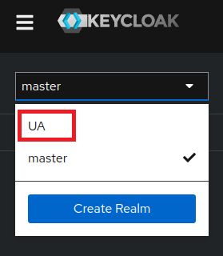
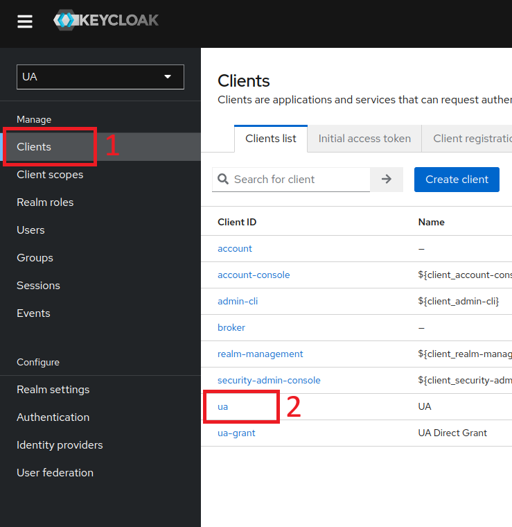
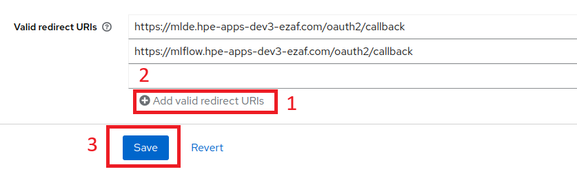
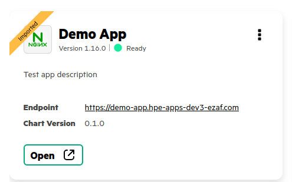

# Tutorial how to integrate application helm chart to deploy on EZUA via Bring Your Own Application feature

This tutorial explain step by step how to prepare and make application helm chart to be compatible with EZUA BYOApp feature.

* [Preparation](#preparation)
  * [Clone the repository, and cd into root directory.](#clone-the-repository-and-cd-into-root-directory)
  * [Get helm chart for application](#get-helm-chart-for-application)
* [Make app helm chart to be compatible with EZUA BYOApp](#make-app-helm-chart-to-be-compatible-with-ezua-byoapp)
  * [Configure application Endpoint/VirtualService](#configure-application-endpointvirtualservice)
    * [Update Application helm chart values.yaml file with `ezua.virtualService` section](#1-update-application-helm-chart-valuesyaml-file-with-ezuavirtualservice-section)
    * [Configure Application istio VirtualService](#2-configure-application-istio-virtualservice)
    * [Troubleshooting](#troubleshooting)
  * [Configure SSO/Authorization](#configure-ssoauthorization)
    * [Update Application helm chart values.yaml file with `ezua.authorizationPolicy` section](#1-update-application-helm-chart-valuesyaml-file-with-ezuaauthorizationpolicy-section)
    * [Configure Application istio security Authorization Policy](#2-configure-application-istio-security-authorization-policy)
    * [How to add redirect URL into keycloak. Optional](#how-to-add-redirect-url-into-keycloak-optional)
  * [How to configure billing](#how-to-configure-billing)
  * [How to add Airgap registry support](#how-to-add-airgap-registry-support)
* [Create EzAppConfig CR template](#create-ezappconfig-cr-template)
* [Deploy EzAppConfig CR](#deploy-ezappconfig-cr)
  * [Troubleshooting](#troubleshooting-1)

## Preparation

### Clone the repository, and cd into root directory.

```bash
git clone git@github.com:HPEEzmeral/byoa-tutorials.git
cd byoa-tutorials
```

### Get helm chart for application

For this demo example was used generated helm chart [test-app](../test-app/README.md) via command `helm create test-app`.
All other steps are appliable for any kind of helm chart. For simplification we will use new demo helm chart `demo-app`.

To create new demo chart use next command:
```bash
helm create demo-app
```
The expected output should be:
```bash
Creating demo-app
```
List `demo-app` directory to ensure it was created. Expected directory structure should be like this:
```
demo-app/
├── charts/
├── Chart.yaml
├── values.yaml
└── templates/
    └── tests/
```

## Make app helm chart to be compatible with EZUA BYOApp

[!IMPORTANT] Before we start, we should ensure that we understand the structure of an application and what service we want to use for the Application endpoint. In this example we have only one [deployment](../test-app/templates/deployment.yaml) and [service](../test-app/templates/service.yaml). Your application may contains more that one service, so you should to decide what actual service will be used as an endpoint.

Create a directory `ezua` in the helm chart templates:
```
mkdir -p demo-app/templates/ezua
```

Create an empty `ezua` section in the helm chart values.yaml file:

[!NOTE] You can use preferable IDE to perform this action.

Insert next lines to the `demo-app/values.yaml` file. You can reffer on the [`test-app/values.yaml`](../test-app/values.yaml#L85) example:
```
#Platform related options
ezua:
```
We will extend `ezua` values later in this tutorial.

### Configure application Endpoint/VirtualService

This step is required to expose the application service to be accessable from the EZUA UI application tile.

### 1. Update Application helm chart values.yaml file with `ezua.virtualService` section.

Add the virtualService section to `ezua` section in values.yaml

```yaml
ezua:
  #Use next options in order to configure the application endpoint.
  virtualService:
    endpoint: "demo-app.${DOMAIN_NAME}"
    istioGateway: "istio-system/ezaf-gateway"
```

The above values would be used to configure virtualService in next step:
[!NOTE] you can use a `${DOMAIN_NAME}` palce holder in values.yaml file, it would be substituted during deploy. Whole list of available placeholders is [here](../api/templates/README.md)
#TODO describe list of available placeholders

### 2. Configure Application istio [VirtualService](https://istio.io/latest/docs/reference/config/networking/virtual-service/)

Copy [example template of istio VirtualService](../ezua/virtualService.yaml) to the helm chart:
```bash
cp ezua/virtualService.yaml demo-app/templates/ezua/
```

Now you need to configure `VirtualService.spec.http.route.destination` to point to expected service:
`demo-app/templates/ezua/virtualService.yaml`
```yaml
        - destination:
            # Insert target service name here
            host: {{ include "demo-app.fullname" . }}.{{ .Release.Namespace }}.svc.cluster.local
            port:
              # Insert target service port number here
              number: {{ .Values.service.port }}
```

### Troubleshooting
* If the Application tile button `open` is not active or do not redirect to correct application endpoint.
  * Ensure that above two steps was performed correctly.
  * Check EzAppConfig.Spec.Values contains corresponding ezua.virtualService section.
  * EzAppConfig.Spec.Values -> ezua.virtualService section has stricted synatax and parsed by EzApp controller.
  * Check ezapp controller logs `kubectl logs -n ezapp-system $(kubectl get pod -n ezapp-system -l control-plane=controller-manager -o jsonpath="{.items[0].metadata.name}")`

### Configure SSO/Authorization

This step is required to configure SSO and Auth controll for the application.

### 1. Update Application helm chart values.yaml file with `ezua.authorizationPolicy` section.

Add the authorizationPolicy section to `ezua` section in values.yaml

```yaml
ezua:
  authorizationPolicy:
    namespace: "istio-system"
    providerName: "oauth2-proxy"
    matchLabels:
      istio: "ingressgateway"
```

The above values would be used to configure istio security authorizationPolicy in next step:

### 2. Configure Application istio security [Authorization Policy](https://istio.io/latest/docs/reference/config/security/authorization-policy/)

Copy [example template authpolicy](../ezua/authpolicy.yaml) to the helm chart:
```bash
cp ezua/authpolicy.yaml demo-app/templates/ezua/
```

### How to add redirect URL into keycloak. Optional

Adding redirect url to keycloak is an optional. If your application doesn't have web interface or doesn't have interface for web based authentication, it is not required to add the redirect URL. If you application can support oauth2 flow, and would like have seamless  SSO experience, you should add the redirect URL. Note: In the next release, this will be automated. If your application can support oauth2 flow and if you don't add redirect URL, the sso experience will be broken. User will be asked to re-enter login credentials to their application.

1. Get admin password for Keycloak admin user:

```
kubectl get secret admin-pass -n keycloak -o jsonpath='{.data.password}' | base64 -d
```

2. Open Keycloak home page at this URL: `https://keycloak.<DOMAIN_NAME>/`
[!NOTE] Use actual <DOMAIN_NAME> above.

3. Go to Administration Console, and login with username `admin` and obtained password.

4. Change realm from master to UA.



5. Go to the Clients on the left nav bar, and select ua client from the list.



6. Go to the Access settings section and in the Valid redirect URIs list click on add button and add the URL (or several URLs) of your application in the format https://${APP_SUBDOMAIN}.${DOMAIN_NAME}/oauth2/callback.



7. After that click on Save button.

Now the Application endpoint URL will redirect to athorization page if you was not athorized yet in EZUA.

### How to configure billing

This step is required to configure Billing for the application. #TODO add url to Billing wiki

Copy [example template authpolicy](../ezua/kyverno-cluster-policy.yaml) to the helm chart:
```bash
cp ezua/kyverno-cluster-policy.yaml demo-app/templates/ezua/
```

This ClusterPolicy assign `hpe-ezua/type: vendor-service` label for every workload resource of the Application

### How to add Airgap registry support

[!NOTE] TODO

## Create EzAppConfig CR template

When the helm chart is ready. We can try to deploy it via EzAppConfig CR.
Create `ezappconfig.yaml` for `demo-app` application. 
[!NOTE] documentation for EzAppConfig CR api is here: [EzAppConfig custom resource API](../api/templates/README.md)

Create new file named `ezappconfig-demo-app-template.yaml` and put it into `api/templates`

```yaml
apiVersion: ezconfig.hpe.ezaf.com/v1alpha1
kind: EzAppConfig
metadata:
  name: ezappconfig-demo-app
  labels:
    # This label is required to determine this App as imported application on the UI.
    hpe-ezua/imported-app: "true" 
spec:
  # Specify chart name here
  # Important! should be equal to the chart name. Look at Chart.yaml. or run command `yq .name demo-app/Chart.yaml`
  name: demo-app
  # Optional. Release name can be any valid k8s name
  # Note: Release Name are limited by 53 symbols by k8s limitations.
  # If releaseName is not specified chart name used as a release name.
  releaseName: demo-app
  # Optional. If the `install` flag is set to `false`, application tile will be added to the UI,
  # but aplication resources wouldn't be deployed at the same time. You can deploy it later from UI Settings page.
  install: "true"
  # Specify chart version here
  # Important! should be equal to the chart version. Look at Chart.yaml. or run command `yq .version demo-app/Chart.yaml`
  chartVersion: 0.1.0
  # Optional. Deprecated. It would be removed in next release.
  # Application version. Used to display app version in the Application tile on the UI.
  # This value would be ignored, appVersion from the Chart.yaml would be picked up.
  version: 1.16.0
  # Optional. Used to display description in the Application tile on the UI.
  description: Test app description
  # Optional. Used to display App Name in free text form in the Application tile on the UI.
  label: Test App
  # Optional. Used to display Application logo image in the Application tile on the UI.
  # Note: logoImage accept base64 encoded png picture string.
  logoImage: ""
  # Required. Used to select in which group the App tile will be displayed in the "Tools & Frameworks" on the UI.
  # allowed values [ dataEngineering, dataScience, analytics ]
  category: dataScience
  # backoffLimit: 2  ## added in EZUA v1.4.0
  # retry: true  ## added in EZUA v1.4.0
  options:
    # Namespace where application would be deployed
    namespace: demo-app-ns
    # If the `create-namespace` flag is set to true. Then App will create namespace if it is not exist.
    create-namespace: "true"
    # If the `wait` flag is set to true. EzApp controller will wait until the application workload reaches a ready state.
    # Otherwise, the controller will deploy the application and mark it as ready. But this does not guarantee that the application is truly ready.
    wait: "true"
    # Time duration to wait for any individual Kubernetes operation (like Jobs for hooks)
    timeout: 15m
    # If the debug flag is set to true. EzAppConfig.Status.FailureReason will contain more information in case of failure.
    debug: "true"
  # Used to override default values from the helm chart values.yaml file.
  # Will replaced with modified values.yaml content next in tutorial.
  values: ""
```

After deploy the above configuration, Application tile will look like on the picture:




[!NOTE] About release name limitation you can read [here](https://helm.sh/docs/chart_template_guide/getting_started/#adding-a-simple-template-call)

[!NOTE] About logoImage. How to put your custom logo image read [here](../api/README.md#configuration) `EZAPP_LOGO_PATH`

## Deploy EzAppConfig CR

Now we can follow steps from the [api/README.md](../api/README.md#configuration) Configuration section.

Change next envs in the [api/tooling/bootstrap.sh](../api/tooling/bootstrap.sh#L8)

```bash
CHART_PATH="${SCRIPT_DIR}/../../demo-app"
EZAPPCONFIG_TEMPLATE_PATH="${SCRIPT_DIR}/../templates/ezappconfig-demo-app-template.yaml"
EZAPP_LOGO_PATH="${SCRIPT_DIR}/../templates/logo.png"
```

You can override default values if needed in [configure](../api/tooling/bootstrap.sh#L37) function.

Finaly we can deploy aour application.

Go to api/tooling directory

```bash
cd api/tooling
```

Run bootstrap.sh script with `install` argument.

```bash
./bootstrap.sh install
```

[!NOTE] Bootstrap.sh script will automatically push the chart tarball to the Chartmuseum internal chart registry.

To check ezappconfig status you can watch it with next commands:

To see short details:
```bash
kubectl get ezappconfigs ezappconfig-demo-app -w
```

To see full details:
```bash
kubectl get ezappconfigs ezappconfig-demo-app -o yaml
```

### Troubleshooting

[!TODO]
